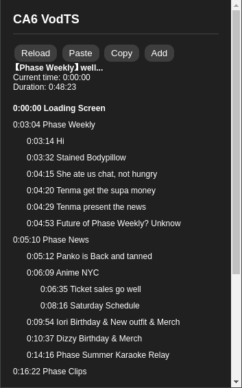

# VodTS

### Get it on the [Chrome Web Store](https://chromewebstore.google.com/detail/vodts/kbommbhbkpmgcfhpallefoiboenmmpap)

## Description
VodTS is a browser extension that displays clickable timestamps for YouTube and Twitch.
It allows you to easily navigate and share specific moments in videos by clicking on timestamps.
On YouTube timestamps are loaded from the video's comments, or from the user's clipboard.
On Twitch timestamps can only be added from the user's clipboard.
The extension can also be used to create a timestamp for videos or livestreams.
The shortcut to create a timestamp is Ctrl+Shift+Z.

## Screenshots


*YouTube video with timestamps loaded from comments*


*Creating a new timestamp using the shortcut (Ctrl+Shift+Z) on YouTube*


*Twitch VOD with user-added timestamps*


*Creating a new timestamp using the shortcut (Ctrl+Shift+Z) on Twitch*

## Use

### Indentation
The extension uses indentation to show the relationship between timestamps.
The indentation is set by using a dot (.) prefix at the beginning of the timestamp description.

For example:
```
0:00:00 This is a chapter
0:00:00 .This is a sub-chapter
0:00:00 ..This is a sub-chapter timestamp
0:00:00 ...This is a misc timestamp
```

Example from a video (Phase Weekly):
```
0:00:00 Loading Screen
0:03:04 Phase Weekly
0:03:14 . Hi
0:03:32 . Stained Bodypillow
0:04:15 . She ate us chat, not hungry
0:04:20 . Tenma get the supa money
0:04:29 . Tenma present the news
0:04:53 . Future of Phase Weekly? Unknow
0:05:10 Phase News
0:05:12 . Panko is Back and tanned
0:06:09 . Anime NYC
0:06:35 .. Ticket sales go well
0:08:16 .. Saturday Schedule
0:09:54 . Iori Birthday & New outfit & Merch
0:10:37 . Dizzy Birthday & Merch
0:14:16 . Phase Summer Karaoke Relay
0:16:22 Phase Clips
0:17:06 . Dizzy ~ Dizzy Stackmaxing ~ Mastergrunt9
0:21:02 . Yuu ~ Yuu Yuus are very YUU ~ VitoW
0:24:49 . Erina ~ Erina's concert troubles ~ RedShipley Clips
0:27:40 . Remi ~ Zoomer Baby Wemi Learns About "Dial Up" ~ Remilia's Sentient Toilet
0:29:55 . Uruka x Lia ~ Uruka Buys Lia a Gift ~ Cpt. Sourcebird
0:34:19 . Shiina x Lumi ~ I Didn't Try to Murder Anyone ~ Harlequin - The Foolish Clipper
0:37:00 . Runie ~ She Went Full Mommy ~ Normie Enjoyer
0:44:29 Conclusion
0:46:51 Endign Screen
0:48:23 End
```

Resulting UI:




## Installation

### Chrome

#### Option 1
1. Install from the [Chrome Web Store](https://chromewebstore.google.com/detail/vodts/kbommbhbkpmgcfhpallefoiboenmmpap)

#### Option 2
1. Download the `unpacked` archive from the latest release and unzip it.
2. Open Chrome (or any Chromium based browser) and navigate to `chrome://extensions`.
3. Enable "Developer mode" in the top right corner.
4. Click "Load unpacked."
5. Select the `unpacked` folder and click "Open."

### Chromium

#### Option 1
1. Install from the [Chrome Web Store](https://chromewebstore.google.com/detail/vodts/kbommbhbkpmgcfhpallefoiboenmmpap)

#### Option 2
1. Download the `crx` file from the latest release.
2. Open Chromium and navigate to `chrome://extensions`.
3. Drag and drop the `crx` file into the page.

#### Option 3
1. Download the `unpacked` archive from the latest release and unzip it.
2. Open Chromium and navigate to `chrome://extensions`.
3. Enable "Developer mode" in the top right corner.
4. Click "Load unpacked."
5. Select the `unpacked` folder and click "Open."

### Firefox
Coming soon, maybe.