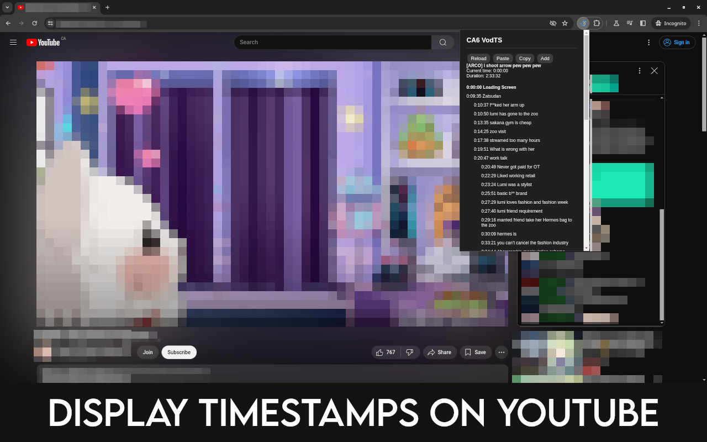
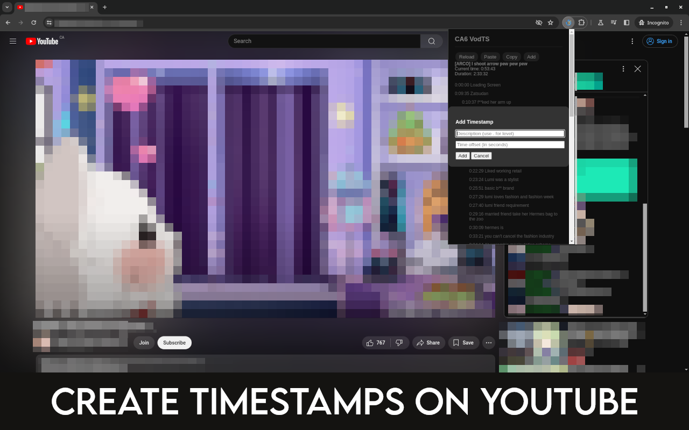
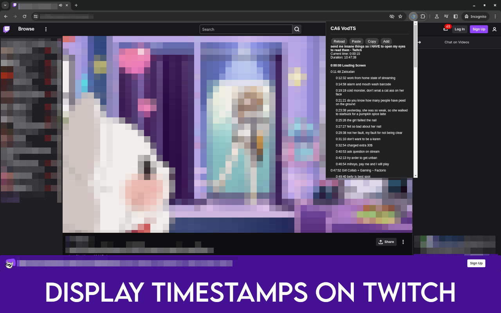
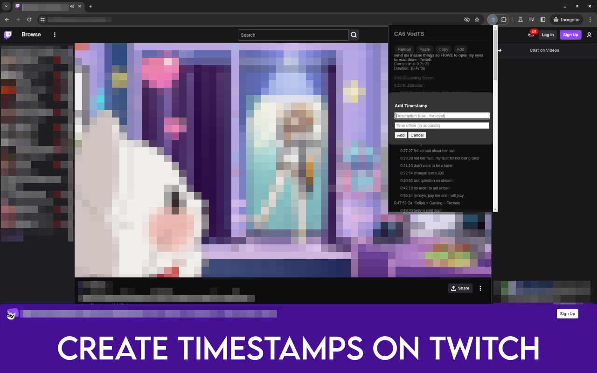

# VodTS

# Description
VodTS is a browser extension that displays clickable timestamps for YouTube and Twitch.
It allows you to easily navigate and share specific moments in videos by clicking on timestamps.
On YouTube timestamps are loaded from the video's comments, or from the user's clipboard.
On Twitch timestamps can only be added from the user's clipboard.
The extension can also be used to create a timestamp for videos or livestreams.
The shortcut to create a timestamp is Ctrl+Shift+Z.

## Screenshots

*YouTube video with timestamps loaded from comments*

*Creating a new timestamp using the shortcut (Ctrl+Shift+Z) on YouTube*

*Twitch VOD with user-added timestamps*

*Creating a new timestamp using the shortcut (Ctrl+Shift+Z) on Twitch*

## Installation

### Chrome

1. Download the `unpacked` archive from the latest release and unzip it.
2. Open Chrome (or any Chromium based browser) and navigate to `chrome://extensions`.
3. Enable "Developer mode" in the top right corner.
4. Click "Load unpacked."
5. Select the `unpacked` folder and click "Open."

### Chromium

#### Option 1
1. Download the `crx` file from the latest release.
2. Open Chromium and navigate to `chrome://extensions`.
3. Drag and drop the `crx` file into the page.

#### Option 2
1. Download the `unpacked` archive from the latest release and unzip it.
2. Open Chromium and navigate to `chrome://extensions`.
3. Enable "Developer mode" in the top right corner.
4. Click "Load unpacked."
5. Select the `unpacked` folder and click "Open."

### Firefox
Coming soon, maybe.