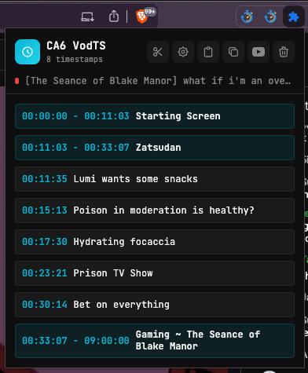
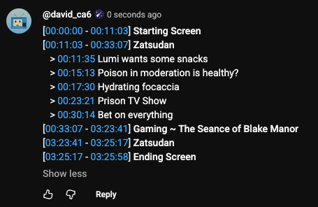
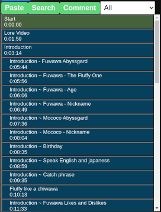
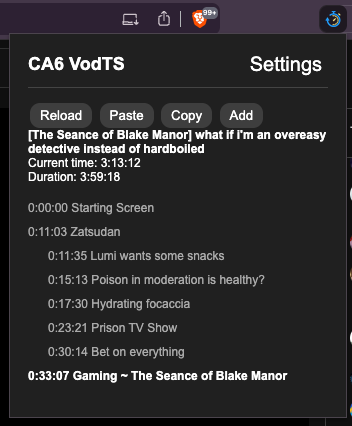
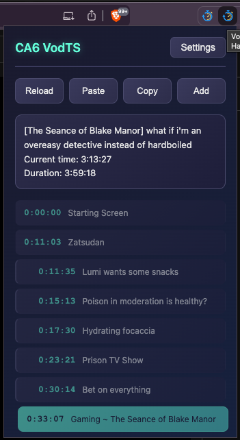

# VodTS

### Get it on the [Chrome Web Store](https://chromewebstore.google.com/detail/vodts/kbommbhbkpmgcfhpallefoiboenmmpap)

## Description
VodTS is a browser extension to create timestamps for YouTube and Twitch Livestreams.
The extension can also be used to display timestamps in a more readable format.

## Features
- Create timestamps for YouTube and Twitch Livestreams
- Display timestamps in a more readable format
- 
- Copy timestamps to the clipboard in YouTube format
- Copy timestamps to the clipboard in VodTS format
- Single button to generate yt-dlp CLI command
- Single button to switch to [ClipIT chat activity analyzer Tool](https://clipit.ca6.dev)



## Timestamp Format

### YouTube
YouTube timestamps format. This format use a format that is easier to read in youtube comments.



`Example with Chapter end time:`
```
[00:00:00 - 00:11:03] *Starting Screen*
[00:11:03 - 00:33:07] *Zatsudan*
   > 00:11:35 Lumi wants some snacks
   > 00:15:13 Poison in moderation is healthy?
   > 00:17:30 Hydrating focaccia
   > 00:23:21 Prison TV Show
   > 00:30:14 Bet on everything
[00:33:07 - 03:23:41] *Gaming ~ The Seance of Blake Manor*
[03:23:41 - 03:25:17] *Zatsudan*
[03:25:17 - 03:25:58] *Ending Screen*
```

`Example without Chapter end time:`
```
[00:00:00] *Starting Screen*
[00:11:03] *Zatsudan*
   > 00:11:35 Lumi wants some snacks
   > 00:15:13 Poison in moderation is healthy?
   > 00:17:30 Hydrating focaccia
   > 00:23:21 Prison TV Show
   > 00:30:14 Bet on everything
[00:33:07] *Gaming ~ The Seance of Blake Manor*
[03:23:41] *Zatsudan*
[03:25:17] *Ending Screen*
```

### VodTS
The extension uses a dot (.) prefix at the beginning of the timestamp description. This format is compatible with **[Clipit](https://clipit.ca6.dev)**.

`Example with Chapter end time:`
```
[The Seance of Blake Manor] what if i'm an overeasy detective instead of hardboiled
https://www.youtube.com/watch?v=8Y8RWtHGgGQ
~00:00:00 - 00:11:03 Starting Screen
~00:11:03 - 00:33:07 Zatsudan
~00:11:35 .Lumi wants some snacks
~00:15:13 .Poison in moderation is healthy?
~00:17:30 .Hydrating focaccia
~00:23:21 .Prison TV Show
~00:30:14 .Bet on everything
~00:33:07 - 03:23:41 Gaming ~ The Seance of Blake Manor
~03:23:41 - 03:25:17 Zatsudan
~03:25:17 - 03:25:58 Ending Screen
[~VodTS~]
```
`Example without Chapter end time:`
```
[The Seance of Blake Manor] what if i'm an overeasy detective instead of hardboiled
https://www.youtube.com/watch?v=8Y8RWtHGgGQ
~00:00:00 Starting Screen
~00:11:03 Zatsudan
~00:11:35 .Lumi wants some snacks
~00:15:13 .Poison in moderation is healthy?
~00:17:30 .Hydrating focaccia
~00:23:21 .Prison TV Show
~00:30:14 .Bet on everything
~00:33:07 Gaming ~ The Seance of Blake Manor
~03:23:41 Zatsudan
~03:25:17 Ending Screen
[~VodTS~]
```

## Installation

### Chrome

#### Option 1
1. Install from the [Chrome Web Store](https://chromewebstore.google.com/detail/vodts/kbommbhbkpmgcfhpallefoiboenmmpap)

#### Option 2
1. Download the `unpacked` archive from the latest release and unzip it.
2. Open Chrome (or any Chromium based browser) and navigate to `chrome://extensions`.
3. Enable "Developer mode" in the top right corner.
4. Click "Load unpacked."
5. Select the `unpacked` folder and click "Open."

### Chromium

#### Option 1
1. Install from the [Chrome Web Store](https://chromewebstore.google.com/detail/vodts/kbommbhbkpmgcfhpallefoiboenmmpap)

#### Option 2
1. Download the `crx` file from the latest release.
2. Open Chromium and navigate to `chrome://extensions`.
3. Drag and drop the `crx` file into the page.

#### Option 3
1. Download the `unpacked` archive from the latest release and unzip it.
2. Open Chromium and navigate to `chrome://extensions`.
3. Enable "Developer mode" in the top right corner.
4. Click "Load unpacked."
5. Select the `unpacked` folder and click "Open."


## VodTS Versions

### VodTS 1 - 1.YY.ZZ
`https://github.com/CA6-LiveTS/VodTS-chrome`  
Released: `June 2023`  
Last update: `September 2023` 



### VodTS 2 - 2.YY.ZZ
`https://github.com/david-ca6/VodTS`  
Released: `August 2024`  
Last update: `January 2025`



New features:
- Player markers
- Indentation for timestamps
- Dark Theme
- Settings menu
    - enable/disable player markers
    - switch between VodTS 1 and VodTS 2 timestamp format

Removed features:
- Search timestamps from the LiveTS database
- Chapter / Timestamp filter

### VodTS 3 - 3.YY.ZZ
`https://github.com/david-ca6/VodTS`  
Released: `Not released, was planned for November 2025`  

A development branch of VodTS intended to modernise the UI, was eventually scrapped in favour of VodTS 4.



### VodTS 4 - 4.YY.ZZ
`https://github.com/david-ca6/VodTS`  
Released: `January 2026`  

VodTS 4.00.00 is a complete rewrite of VodTS, more focused on clipper and timestamper use than general user.


New features:
- New UI design
- Support for generating yt-dlp CLI commands
- Support for ClipIT (https://clipit.ca6.dev)
- End time for timestamps (optional to create chapters)
- New timestamp export format optimized for youtube comments  

Removed features:
- Player markers
- Loading timestamps from comments
- Indentation for timestamps (replaced by chapter with end time)

